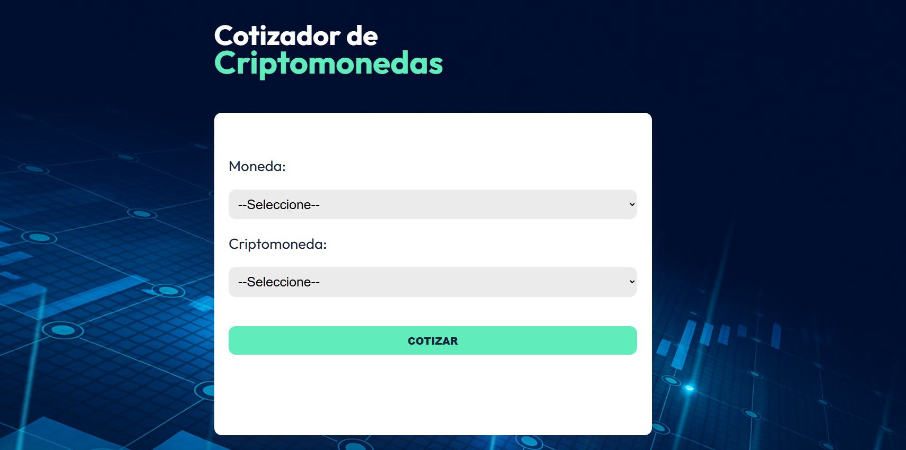
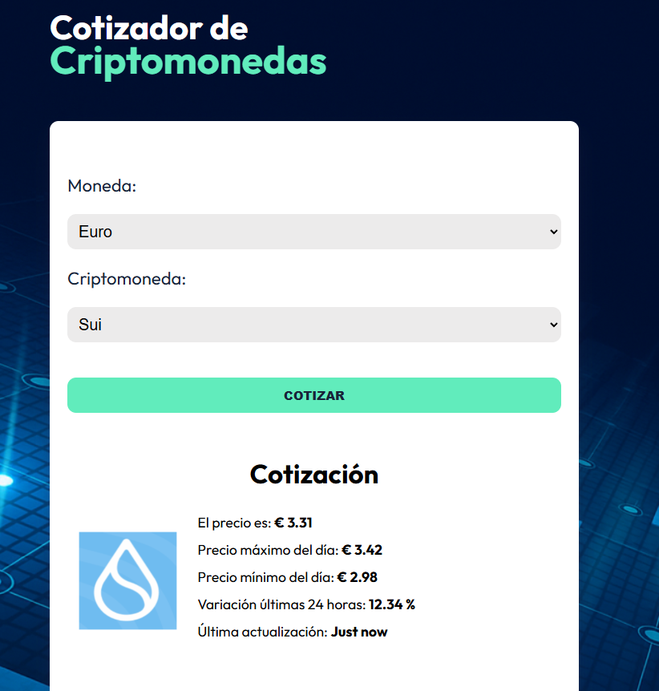

# ₿ Cotizador de criptomonedas API 💲

Esta app permite consultar información sobre una criptomoneda mostrando datos confiables y bien validados. Fue desarrollada con un stack moderno, aprovechando React con TypeScript, y herramientas de validación como Zod para manejar los datos de la API de manera segura y eficiente.

## 🧪 Tecnologías utilizadas

- ⚛️ React
- 🟦 TypeScript
- ⚡ Vite
- 🎨 CSS
- 📡 Axios
- 🛡️ Zod (validación de datos)
- 🧰 ESLint + TypeScript Plugin

## 🚀 Demo en vivo

👉 [https://cotizador-crypto-api.netlify.app/](https://cotizador-crypto-api.netlify.app/)

## 🖼️ Capturas

Vista principal:

Búsqueda de una cripto:

